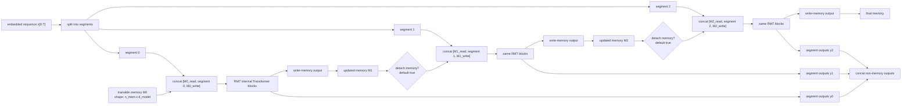
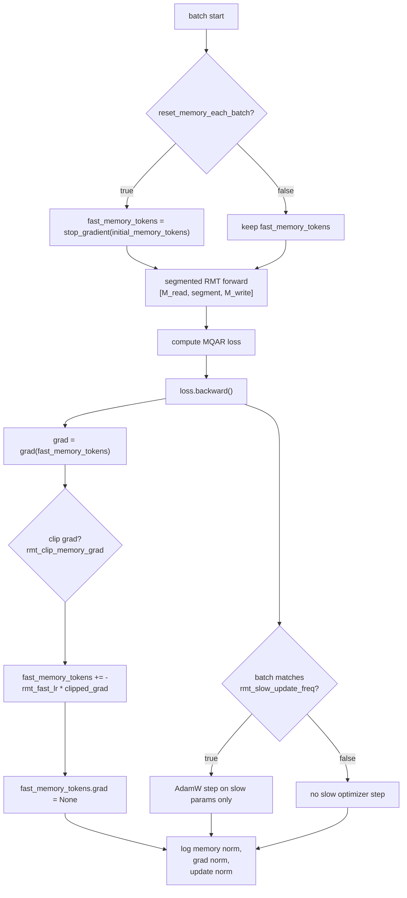

# RMT MQAR Model Architectures

This document describes the three model families used by the RMT MQAR
experiments:

- baseline causal Transformer/MHA
- Base Recurrent Memory Transformer (Base RMT)
- Fast Memory Recurrent Memory Transformer (Fast Memory RMT)

The runnable experiment configs are in `zoology/experiments/rmt_mqar/`.
The shared model factories are in `_common.py`, and the RMT mixers are in
`zoology/mixers/rmt.py`.

## Shared Zoology Wrapper

All three models are `LanguageModel` instances built from `ModelConfig`.
The discrete language model path is:

```text
input token ids
  -> token embeddings + positional embeddings
  -> LMBackbone layers
  -> final dropout + final layer norm
  -> tied vocabulary projection
  -> logits over vocab at every position
```

Each `TransformerBlock` in the backbone has this structure:

```text
hidden/residual
  -> dropout/drop path
  -> residual add
  -> layer norm
  -> sequence_mixer
  -> dropout/drop path
  -> residual add
  -> layer norm
  -> state_mixer
```

For the baseline, `sequence_mixer` is causal MHA and `state_mixer` is an MLP.
For both RMT variants, `sequence_mixer` is the RMT mixer and `state_mixer` is
`torch.nn.Identity`, because the RMT mixer already contains attention and MLP
blocks internally.

## Baseline Transformer/MHA

Factory: `transformer_model()` in `_common.py`

Default experiment settings:

```text
model.name = "attention"
outer block_type = TransformerBlock
outer n_layers = 2
d_model = 64
n_heads = 2
sequence_mixer = zoology.mixers.attention.MHA
state_mixer = zoology.mixers.mlp.MLP(hidden_mult=4)
dropout = 0.0 for attention
embed_dropout = 0.1 from ModelConfig default
```

The MHA mixer is standard causal self-attention:

```text
x
  -> linear Wqkv
  -> split into Q, K, V heads
  -> causal softmax attention
  -> output projection
```

This baseline attends over the full sequence in each layer. Its attention state
size scales with sequence length.

## Base RMT

Factory: `base_rmt_model()` in `_common.py`

Mixer implementation: `BaseRMTMixer` in `zoology/mixers/rmt.py`

Default experiment settings:

```text
model.name = "base_rmt"
outer block_type = TransformerBlock
outer n_layers = 1
d_model = 64
n_heads = 2
RMT internal n_layers = 2
n_mem = 4
segment_len = 64, except smoke uses 32
sequence_mixer = zoology.mixers.rmt.BaseRMTMixer
state_mixer = torch.nn.Identity
detach_memory_between_segments = True
memory_layout = "read_write"
```

Base RMT splits the embedded sequence into fixed-size segments. The active
experiment configs use a read/write memory layout:

```text
[M_read, segment_tokens, M_write]
```

`M_read` is the memory carried from the previous segment. `M_write` starts from
the same memory values, but its output positions become the memory for the next
segment. Only segment-token outputs are returned to the outer language model.

The older prefix-only layout `[memory, segment]` is still available with
`memory_layout="prefix"` for ablations, but it is not the default experiment
layout.



One internal RMT block is:

```text
[M_read, segment, M_write]
  -> layer norm
  -> multi-head attention
  -> residual add
  -> layer norm
  -> MLP: Linear -> GELU -> Dropout -> Linear
  -> residual add
```

The attention mask is implemented as follows:

- read-memory rows can attend only to read-memory columns
- segment tokens can attend to read memory
- segment tokens use a causal mask over other segment tokens
- segment tokens cannot attend to write memory
- write-memory rows can attend to read memory, all segment tokens, and write
  memory tokens

This prevents current-segment future information from flowing back into segment
token outputs through memory when multiple internal RMT blocks are used. The
write-memory outputs are only used as memory for the next segment.

Logged diagnostics:

```text
train/rmt_memory_norm
```

## Fast Memory RMT

Factory: `fast_memory_rmt_model()` in `_common.py`

Mixer implementation: `FastMemoryRMTMixer` in `zoology/mixers/rmt.py`

Default experiment settings:

```text
model.name = "fast_memory_rmt"
outer block_type = TransformerBlock
outer n_layers = 1
d_model = 64
n_heads = 2
RMT internal n_layers = 2
n_mem = 4
segment_len = 64, except smoke uses 32
sequence_mixer = zoology.mixers.rmt.FastMemoryRMTMixer
state_mixer = torch.nn.Identity
detach_memory_between_segments = False
memory_layout = "read_write"
rmt_fast_lr = 0.05
rmt_slow_update_freq = 1
rmt_clip_memory_grad = 1.0
reset_memory_each_batch = True
reset_memory_each_epoch = False
```

Fast Memory RMT uses the same segmented RMT forward pass as Base RMT, but it
separates memory into:

- `initial_memory_tokens`: slow trainable memory parameter, updated by optimizer
- `fast_memory_tokens`: fast memory parameter, excluded from the optimizer and
  updated manually after backpropagation

During training, the effective initial memory is:

```text
effective_memory = fast_memory_tokens
                   + initial_memory_tokens
                   - stop_gradient(initial_memory_tokens)
```

This has the value of `fast_memory_tokens`, while still allowing gradients to
flow into `initial_memory_tokens` for slow learning.



The trainer calls `update_fast_memory()` immediately after `loss.backward()`.
The slow optimizer never owns `fast_memory_tokens`; it only updates ordinary
model weights and `initial_memory_tokens`.

Logged diagnostics:

```text
train/rmt_memory_norm
train/rmt_memory_grad_norm
train/rmt_memory_update_norm
```

## Side-by-Side Summary

| Model | Outer layers | Sequence mixer | State mixer | Memory | Segmenting | Manual fast update |
|---|---:|---|---|---|---|---|
| Transformer/MHA | 2 | causal MHA | MLP | none | no | no |
| Base RMT | 1 | BaseRMTMixer | Identity | trainable read/write memory | yes | no |
| Fast Memory RMT | 1 | FastMemoryRMTMixer | Identity | slow initial + fast read/write memory | yes | yes |

The RMT models are not simply deeper Transformers with memory tokens inserted
once. They are recurrent segment processors: read memory is supplied to every
segment, write memory is extracted after processing that segment, and the write
memory becomes read memory for the next segment.
